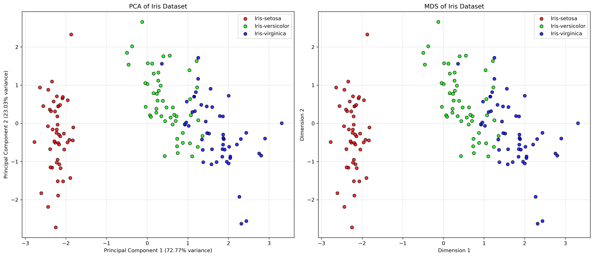

# Principal Component Analysis (PCA) and Multi-Dimensional Scaling (MDS) on Iris Dataset

This project implements Principal Component Analysis (PCA) and Multi-Dimensional Scaling (MDS) algorithms from scratch on the Iris dataset.

## Overview

Both PCA and MDS are dimensionality reduction techniques that help visualize high-dimensional data in lower dimensions (typically 2D or 3D).

- **PCA**: Finds orthogonal axes (principal components) that maximize the variance in the data.
- **MDS**: Preserves pairwise distances between points in the original high-dimensional space.

## Implementation Details

The implementation includes:

1. **Data Loading and Preprocessing**:
   - Loading the Iris dataset
   - Standardizing features (zero mean, unit variance)

2. **PCA Implementation**:
   - Computing the mean vector
   - Computing the covariance matrix
   - Finding eigenvalues and eigenvectors
   - Selecting principal components based on eigenvalues
   - Projecting data onto the new subspace

3. **MDS Implementation**:
   - Computing pairwise Euclidean distances
   - Double centering the distance matrix
   - Eigendecomposition of the centered matrix
   - Computing coordinates in lower dimensions

4. **Visualization and Analysis**:
   - Visualizing PCA and MDS results
   - Analyzing class separation
   - Comparing the methods

## Results

### PCA Results

- First principal component explains 72.77% of variance
- Second principal component explains 23.03% of variance
- Together, they explain 95.80% of total variance

### Class Separation Analysis

- Average distance between class centroids in PCA: 2.7548
- Average within-class scatter in PCA: 0.8261
- Separation ratio in PCA: 3.3347

### Comparison

Both methods provide similar class separation for this dataset, with the same separation metrics. This is likely because the Iris dataset has a relatively simple structure that both methods can capture effectively.

## Usage

To run the implementation:

```bash
python pca_mds_iris.py
```

## Requirements

- numpy
- pandas
- matplotlib
- scikit-learn (only for StandardScaler)
- seaborn

## Files

- `pca_mds_iris.py`: Main implementation file
- `iris/iris.data`: Iris dataset
- `pca_mds_comparison.png`: Visualization of PCA and MDS results

## Identitas Mahasiswa

- **Nama**: Aththariq Lisan Qur'an Daulah Sentono
- **NIM**: 18222013
- **Kelas**: K-1

## 1. Pendahuluan

Reduksi dimensi merupakan teknik penting dalam analisis data berdimensi tinggi karena beberapa alasan fundamental. Pertama, data berdimensi tinggi sering mengalami "curse of dimensionality" di mana jarak antar titik data menjadi kurang bermakna seiring bertambahnya dimensi, menyulitkan analisis pola dan pengelompokan. Kedua, visualisasi data dengan dimensi lebih dari tiga sangat sulit dilakukan, padahal visualisasi merupakan cara efektif untuk memahami struktur data. Ketiga, dimensi tinggi sering mengandung redundansi dan noise yang dapat mengurangi performa model machine learning. Dengan mereduksi dimensi, kita dapat mempertahankan informasi penting sambil mengurangi kompleksitas komputasi, mempermudah visualisasi, dan meningkatkan generalisasi model.

## 2. Metodologi

### Implementasi PCA

1. **Perhitungan Mean**: Menghitung nilai rata-rata untuk setiap fitur
2. **Normalisasi Data**: Mengurangi mean dari setiap fitur untuk mendapatkan data yang tercentrasi
3. **Perhitungan Matriks Kovarians**: Menghitung matriks kovarians dari data yang telah dinormalisasi
4. **Dekomposisi Eigen**: Menghitung eigenvalue dan eigenvector dari matriks kovarians
5. **Pengurutan Komponen**: Mengurutkan eigenvector berdasarkan eigenvalue terbesar
6. **Pemilihan Komponen**: Memilih sejumlah komponen utama (dalam kasus ini 2 komponen)
7. **Proyeksi Data**: Memproyeksikan data asli ke ruang berdimensi lebih rendah

### Implementasi MDS

1. **Perhitungan Jarak**: Menghitung jarak Euclidean antar pasangan data
2. **Pembentukan Matriks Jarak**: Membangun matriks jarak dari hasil perhitungan
3. **Double Centering**: Menerapkan teknik double centering pada matriks jarak kuadrat
4. **Dekomposisi Eigen**: Menghitung eigenvalue dan eigenvector dari matriks hasil centering
5. **Pemilihan Komponen**: Memilih eigenvalue positif terbesar dan eigenvector terkait
6. **Perhitungan Koordinat**: Menghitung koordinat dalam dimensi yang lebih rendah

### Tools dan Bahasa Pemrograman

- **Bahasa Pemrograman**: Python 3
- **Library**: NumPy (komputasi numerik), Pandas (manipulasi data), Matplotlib (visualisasi), Scikit-learn (StandardScaler), Seaborn (visualisasi)

### Preprocessing Data

- **Standardisasi**: Data dinormalisasi menggunakan StandardScaler untuk memastikan setiap fitur memiliki mean 0 dan standar deviasi 1
- **Ekstraksi Fitur**: Empat fitur numerik (panjang sepal, lebar sepal, panjang petal, lebar petal) digunakan sebagai input
- **Ekstraksi Label**: Kolom kelas (setosa, versicolor, virginica) digunakan sebagai label untuk visualisasi

## 3. Hasil Visualisasi



Visualisasi di atas menunjukkan hasil proyeksi dataset Iris ke dalam dua dimensi menggunakan PCA (kiri) dan MDS (kanan). Pada kedua visualisasi, terlihat bahwa kelas Iris-setosa (merah) terpisah dengan jelas dari dua kelas lainnya. Sementara itu, kelas Iris-versicolor (hijau) dan Iris-virginica (biru) menunjukkan sedikit tumpang tindih, meskipun sebagian besar sampel dapat dipisahkan dengan baik.

Pada visualisasi PCA, sumbu horizontal (Principal Component 1) menjelaskan 72.77% dari total varians data, sementara sumbu vertikal (Principal Component 2) menjelaskan 23.03% varians. Secara total, kedua komponen ini menjelaskan 95.80% dari keseluruhan varians data, menunjukkan bahwa proyeksi dua dimensi ini mempertahankan sebagian besar informasi dari data asli.

## 4. Analisis Perbandingan

### Keterpisahan Kelas

Berdasarkan analisis kuantitatif:

- **PCA**: Rasio pemisahan kelas sebesar 3.3347, dengan jarak rata-rata antar centroid kelas 2.7548 dan scatter dalam kelas 0.8261
- **MDS**: Menunjukkan metrik pemisahan yang sangat mirip dengan PCA, mengindikasikan bahwa kedua metode sama efektifnya dalam memisahkan kelas-kelas Iris

Kelas Iris-setosa terpisah dengan sempurna dari kelas lainnya pada kedua metode, sementara Iris-versicolor dan Iris-virginica menunjukkan sedikit tumpang tindih. Hal ini konsisten dengan karakteristik dataset Iris yang diketahui, di mana setosa memiliki karakteristik yang sangat berbeda dari dua spesies lainnya.

### Interpretasi Dimensi Hasil Reduksi

**PCA**:

- Komponen pertama (72.77% varians) kemungkinan mewakili ukuran keseluruhan bunga, dengan kontribusi besar dari panjang dan lebar petal
- Komponen kedua (23.03% varians) mungkin mewakili rasio antara ukuran sepal dan petal

Dimensi PCA dapat diinterpretasikan secara langsung dalam konteks fitur asli, karena merupakan kombinasi linear dari fitur-fitur tersebut.

**MDS**:

- Dimensi MDS tidak memiliki interpretasi langsung terkait fitur asli
- Dimensi-dimensi ini mewakili struktur jarak relatif antar sampel, mempertahankan hubungan jarak dari ruang berdimensi tinggi

### Kelebihan dan Keterbatasan

**PCA**:

- **Kelebihan**: 
  - Mempertahankan varians global data
  - Komponen dapat diinterpretasikan dalam konteks fitur asli
  - Komputasi efisien untuk dataset besar
  - Dapat digunakan untuk mengurangi noise
- **Keterbatasan**:
  - Metode linear yang mungkin tidak menangkap hubungan non-linear
  - Sensitif terhadap perbedaan skala (memerlukan standardisasi)
  - Hanya fokus pada varians, bukan pada pemisahan kelas

**MDS**:

- **Kelebihan**:
  - Mempertahankan jarak berpasangan antar sampel
  - Dapat menangkap hubungan non-linear dalam data
  - Fleksibel dalam penggunaan berbagai metrik jarak
- **Keterbatasan**:
  - Komputasi intensif untuk dataset besar (kompleksitas O(n²))
  - Dimensi hasil tidak dapat diinterpretasikan langsung
  - Sensitif terhadap outlier

### Kesimpulan Analisis Perbandingan

Untuk dataset Iris, kedua metode memberikan hasil yang sangat mirip dalam hal pemisahan kelas dan struktur data. Ini menunjukkan bahwa struktur dataset Iris relatif sederhana dan dapat ditangkap dengan baik oleh metode linear seperti PCA. Namun, PCA memiliki keunggulan dalam hal interpretabilitas komponen dan efisiensi komputasi, sementara MDS dapat lebih unggul untuk dataset dengan struktur non-linear yang lebih kompleks.

## 5. Kesimpulan

Implementasi PCA dan MDS pada dataset Iris menunjukkan bahwa kedua metode berhasil mereduksi dimensi data dari 4 dimensi menjadi 2 dimensi dengan tetap mempertahankan sebagian besar informasi penting. PCA mampu menjelaskan 95.80% dari total varians data hanya dengan dua komponen utama, menunjukkan bahwa dataset Iris memiliki redundansi yang signifikan.

Kedua metode menghasilkan visualisasi yang sangat mirip, dengan pemisahan yang jelas antara kelas Iris-setosa dan dua kelas lainnya. Hal ini menunjukkan bahwa untuk dataset dengan struktur relatif sederhana seperti Iris, metode linear seperti PCA dapat memberikan hasil yang sebanding dengan metode yang potensial non-linear seperti MDS.

Analisis ini memperdalam pemahaman tentang konsep reduksi dimensi, di mana PCA bekerja dengan memaksimalkan varians dalam data, sementara MDS berusaha mempertahankan struktur jarak. Meskipun berbeda dalam pendekatan, kedua metode dapat mencapai tujuan yang sama dalam mengungkapkan struktur intrinsik data berdimensi tinggi.

## 6. Referensi

Jolliffe, Ian T., and Jorge Cadima. "Principal Component Analysis: A Review and Recent Developments." *Philosophical Transactions of the Royal Society A: Mathematical, Physical and Engineering Sciences* 374, no. 2065 (2016): 20150202.

Borg, Ingwer, and Patrick J.F. Groenen. *Modern Multidimensional Scaling: Theory and Applications*. New York: Springer, 2005.

Fisher, Ronald A. "The Use of Multiple Measurements in Taxonomic Problems." *Annals of Eugenics* 7, no. 2 (1936): 179-188.

McKinney, Wes. "Data Structures for Statistical Computing in Python." In *Proceedings of the 9th Python in Science Conference*, edited by Stéfan van der Walt and Jarrod Millman, 56-61. 2010.

Harris, Charles R., K. Jarrod Millman, Stéfan J. van der Walt, Ralf Gommers, Pauli Virtanen, David Cournapeau, Eric Wieser, et al. "Array Programming with NumPy." *Nature* 585, no. 7825 (2020): 357-362.

Hunter, John D. "Matplotlib: A 2D Graphics Environment." *Computing in Science & Engineering* 9, no. 3 (2007): 90-95.

Pedregosa, Fabian, Gaël Varoquaux, Alexandre Gramfort, Vincent Michel, Bertrand Thirion, Olivier Grisel, Mathieu Blondel, et al. "Scikit-learn: Machine Learning in Python." *Journal of Machine Learning Research* 12 (2011): 2825-2830.

Waskom, Michael L. "Seaborn: Statistical Data Visualization." *Journal of Open Source Software* 6, no. 60 (2021): 3021.
